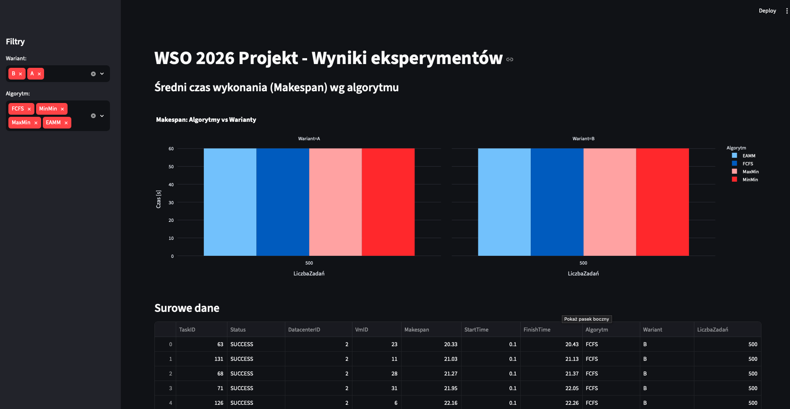
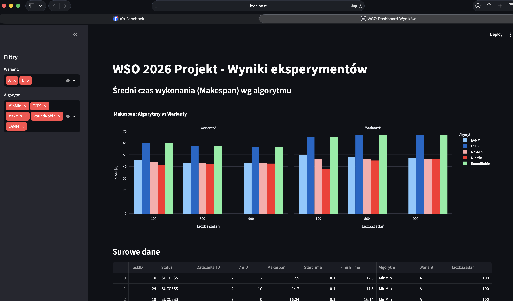
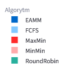
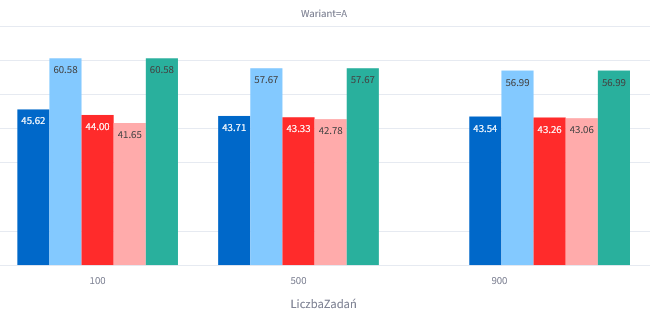
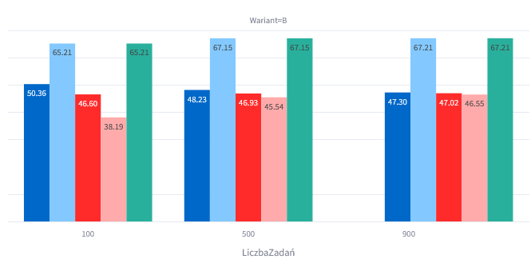
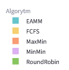
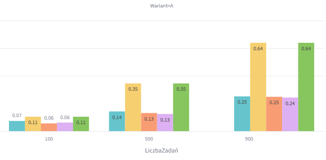
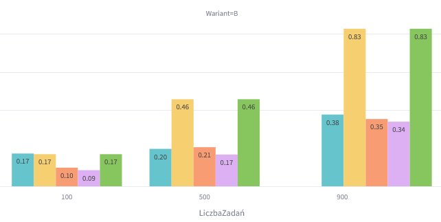

# Projekt WSO: Alokacja zadań w chmurze (CloudSim)

# 0. Wstęp

#### 0.1. Kontekst i background biznesowy
Współczesne platformy streamingowe, takie jak np. YouTube, mierzą się codziennie z wyzwaniem przetwarzania masowych ilości danych wideo. W momencie, gdy użytkownik przesyła nowy plik na platformę, system nie tylko zapisuje surowy materiał, ale musi natychmiast uruchomić sekwencję zróżnicowanych operacji przetwarzania. Należą do nich m.in. konwersja filmu do wielu różnych rozdzielczości (transkodowanie), generowanie miniatur podglądu, zaawansowana kompresja danych, automatyczna analiza treści pod kątem bezpieczeństwa oraz ostateczny zapis w rozproszonej strukturze pamięci masowej. 

Z punktu widzenia inżynierii systemów chmurowych, każda z tych operacji stanowi pojedyncze, niezależne zadanie obliczeniowe (w nomenklaturze chmurowej: *task* lub *cloudlet*), które musi zostać precyzyjnie przypisane do odpowiedniej maszyny wirtualnej (VM) funkcjonującej w centrum danych.

### 0.2. Definicja problemu badawczego
Głównym problemem, na który odpowiada niniejszy projekt, jest zarządzanie zasobami w godzinach szczytowego natężenia ruchu na platformie. Gdy liczba przesyłanych jednocześnie materiałów gwałtonie rośnie, w infrastrukturze chmurowej dochodzi do zjawiska przeciążenia serwerów, drastycznego wydłużenia czasu oczekiwania na przetworzenie filmów, skokowego wzrostu zużycia energii elektrycznej oraz bezpośredniego ryzyka wystąpienia awarii lub opóźnień po stronie użytkownika końcowego.

Kluczem do optymalizacji takiego środowiska nie jest bezmyślne dokładanie kolejnych fizycznych serwerów, lecz zastosowanie inteligentnego algorytmu alokacji zadań. Problem sprowadza się do znalezienia takiej strategii, która pozwoli na jednoczesne skrócenie czasu przetwarzania plików (Makespan), zminimalizowanie przeciążeń maszyn wirtualnych oraz redukcję zużycia energii całego centrum danych.

### 0.3. Cel i zakres projektu
Głównym celem badawczym jest implementacja, analiza porównawcza oraz ocena efektywności różnych algorytmów szeregowania zadań w środowisku chmurowym symulowanym za pomocą zaawansowanego frameworka CloudSim. W ramach prac porównano klasyczne podejścia inżynierskie, takie jak:
* **FCFS (First Come First Serve):** podejście kolejki naiwnej realizujące zadania dokładnie w kolejności ich napływania.
* **Min-Min:** algorytm zachłanny, przydzielający najkrótsze zadania do maszyn zapewniających najszybszy czas wykonania.
* **Max-Min:** strategia dająca pierwszeństwo zadaniom najdłuższym, zapobiegająca blokowaniu dużych procesów w kolejce.

Istotnym punktem i unikalną wartością projektu jest opracowanie, zaimplementowanie i przetestowanie własnej autorskiej modyfikacji algorytmu o nazwie EAMM (Energy-Aware Min-Min). Projekt ma na celu udzielenie odpowiedzi na fundamentalne pytanie z zakresu Green Computing: czy możliwe jest efektywne zmniejszenie zużycia energii centrum danych poprzez zrównoważone rozkładanie obciążenia infrastruktury, bez drastycznego i zauważalnego pogorszenia ogólnej wydajności czasowej systemu?


### 1. Struktura projektu

Projekt został zaimplementowany w języku Java z wykorzystaniem biblioteki CloudSim 3.0.3. Jego celem jest porównanie różnych algorytmów alokacji zadań w środowisku chmurowym oraz ocena ich wpływu na czas realizacji zadań i zużycie zasobów. Dodatkowo przygotowano dashboard analityczny w Pythonie umożliwiający wizualizację wyników eksperymentów.

#### 1.1 Struktura katalogów

```text
├── lib
├── src
│   └── main/java/pl/edu/pw/wso
│       ├── algorithms
│       ├── experiments
│       ├── infrastructure
│       └── utils
├── app.py
├── pom.xml
└── requirements.txt
```

#### 1.2 Moduł algorytmów

Pakiet `algorithms` zawiera implementacje badanych algorytmów szeregowania zadań:

* **MinMinAllocator.java** – implementacja algorytmu Min-Min, który przypisuje zadania do maszyn wirtualnych minimalizujących przewidywany czas zakończenia wykonania.
* **MaxMinAllocator.java** – implementacja algorytmu Max-Min, preferującego najdłuższe zadania w celu ograniczenia ich oczekiwania na wykonanie.
* **RoundRobinAllocator.java** – implementacja algorytmu Round Robin realizującego cykliczne przydzielanie zadań do kolejnych maszyn wirtualnych.
* **EammAllocator.java** – autorski algorytm Energy-Aware Min-Min (EAMM), uwzględniający zarówno przewidywany czas wykonania zadania, jak i aktualne obciążenie maszyny wirtualnej.

#### 1,3 Moduł eksperymentów

Pakiet `experiments` odpowiada za uruchamianie symulacji dla poszczególnych algorytmów:

* **BaselineExperiment.java** – eksperyment referencyjny wykorzystujący domyślny mechanizm przydziału zadań.
* **MinMinExperiment.java** – uruchomienie symulacji z algorytmem Min-Min.
* **MaxMinExperiment.java** – uruchomienie symulacji z algorytmem Max-Min.
* **RoundRobinExperiment.java** – uruchomienie symulacji z algorytmem Round Robin.
* **EammExperiment.java** – uruchomienie symulacji z autorskim algorytmem EAMM.

Każda klasa eksperymentu odpowiada za przygotowanie środowiska, wygenerowanie zadań, wykonanie symulacji oraz zapis wyników.

#### 1.4 Moduł infrastruktury

Pakiet `infrastructure` zawiera elementy odpowiedzialne za budowę środowiska symulacyjnego:

* **DatacenterFactory.java** – tworzy centrum danych, hosty fizyczne oraz maszyny wirtualne dla wariantów infrastruktury wykorzystywanych w eksperymentach.
* **TaskFactory.java** – generuje zestawy zadań (Cloudlets) o zróżnicowanych parametrach obliczeniowych i rozmiarach danych wejściowych.

#### 1.5 Moduł narzędzi pomocniczych

Pakiet `utils` zawiera klasy wspierające analizę wyników:

* **CsvExporter.java** – eksportuje wyniki symulacji do plików CSV wykorzystywanych w dalszej analizie.

#### 1.6 Dashboard analityczny

* **app.py** – aplikacja napisana w Pythonie z wykorzystaniem biblioteki Streamlit. Odpowiada za agregację wyników eksperymentów oraz ich prezentację w postaci interaktywnych wykresów i tabel.

#### 1.7 Pliki konfiguracyjne

* **pom.xml** – plik konfiguracyjny Maven zarządzający zależnościami projektu oraz procesem budowania aplikacji.
* **requirements.txt** – lista bibliotek Python wymaganych do uruchomienia dashboardu analitycznego.

Przepływ działania projektu rozpoczyna się od wygenerowania infrastruktury i zadań, następnie wybrany algorytm dokonuje alokacji zadań do maszyn wirtualnych, po czym wykonywana jest symulacja w środowisku CloudSim. Wyniki są eksportowane do plików CSV i wizualizowane za pomocą dashboardu Streamlit.


### 2. Eksperymenty

Wyniki eksperymentów zapisywane są automatycznie w folderze `DATA/`. Pliki mają przypisywane tagi w nazwie, zgodnie z wykorzystanym algorytmem, wariantem hosta oraz ilością tasków (np. `wyniki_EAMM_A_500.csv`).

#### 2.1 Metodyka i zakres przeprowadzonych badań
W celu rzetelnej oceny zaimplementowanych algorytmów alokacji zadań (FCFS, Min-Min, Max-Min oraz autorskiego EAMM), przygotowano kompleksowe środowisko symulacyjne oparte na bibliotece CloudSim. Aby wyniki eksperymentów wiernie odzwierciedlały warunki panujące w rzeczywistych, rozproszonych centrach danych, wprowadzono kluczowy element heterogeniczności zasobów i zadań. Maszyny wirtualne dysponują zróżnicowaną mocą obliczeniową (od 500 do 2500 MIPS), a generowane zadania różnią się długością i wymaganym czasem przetwarzania (symulacja różnego rodzaju operacji, np. od kompresji wideo po generowanie miniatur).


#### 2.2 Faza kalibracji: Wpływ homogeniczności środowiska na wyniki
W początkowej fazie eksperymentów napotkano anomalię polegającą na tym, że wszystkie badane algorytmy (FCFS, Min-Min, Max-Min oraz EAMM) osiągały niemal identyczny czas wykonania (Makespan oscylujący na płaskim poziomie ok. 60 sekund). Analiza tego zjawiska dostarczyła istotnych wniosków na temat samej natury chmurowych algorytmów przydziału.

**Identyfikacja problemu:**
Przyczyną identycznych wyników był brak początkowego zróżnicowania (heterogeniczności) maszyn wirtualnych. W pierwotnej konfiguracji każdej maszynie wirtualnej przydzielono dokładnie taką samą moc obliczeniową (sztywny limit 1000 MIPS). W środowisku całkowicie homogenicznym, gdzie każda jednostka jest tak samo szybka, zaawansowane algorytmy heurystyczne tracą swoje pole manewru decyzyjnego. Niezależnie od tego, czy zadanie przydzielał naiwny algorytm FCFS, czy poszukujący optymalizacji Min-Min, czas jego przetworzenia był z góry zdeterminowany i stały dla każdej maszyny. W efekcie wszystkie algorytmy degradowały się do roli prostego rozdzielacza zadań (typu Round-Robin/Load Balancer).




**Wdrożone rozwiązanie i wnioski badawcze:**
Aby środowisko symulacyjne nabrało wartości analitycznej i wiernie odzwierciedlało rzeczywiste centra danych (gdzie występują zarówno słabe, jak i potężne instancje obliczeniowe), przeprowadzono rekonfigurację alokatora maszyn. Wprowadzono pule maszyn wirtualnych o zróżnicowanej mocy (od wolnych instancji 500 MIPS po wysoce wydajne węzły 2500 MIPS). 

Dopiero wprowadzenie heterogeniczności środowiska "odblokowało" potencjał badanych heurystyk:
* **Min-Min i Max-Min** zyskały możliwość aktywnego poszukiwania najszybszych instancji i kierowania na nie odpowiednich zadań, co od razu drastycznie skróciło Makespan.
* **EAMM** mógł zaprezentować swoją autorską mechanikę obliczania kary za obciążenie (load penalty), unikając zjawiska "zatykania" nielicznych, najszybszych maszyn nadmierną liczbą zadań.

Powyższe studium przypadku stanowi twardy dowód na to, że stosowanie skomplikowanych heurystyk przydziału ma uzasadnienie inżynierskie i biznesowe wyłącznie w środowiskach heterogenicznych. W infrastrukturze homogenicznej nakład obliczeniowy na działanie algorytmu mija się z celem, gdyż najprostsza polityka kolejkowania przynosi identyczne rezultaty czasowe.


#### 2.3 Wizualizacja docelowa
Aby lepiej zilustrować opisane różnice w czasie wykonania dla badanych scenariuszy, wyniki zostały przetworzone za pomocą dedykowanego panelu analitycznego. Przygotowany dashboard składa się z trzech głównych elementów: bocznego panelu filtrów (pozwalającego na dynamiczne włączanie i wyłączanie widoczności wariantów oraz algorytmów), zgrupowanego wykresu słupkowego prezentującego zestawienie czasowe z podziałem na obciążenie zadaniami, a także interaktywnej tabeli zawierającej surowe logi z przebiegu symulacji. Poniżej zamieszczono zrzut ekranu prezentujący główne zestawienie:




#### 2.4 Eksperymenty właściwe

Zestaw eksperymentów oparto na trzech głównych wymiarach testowych, co pozwala na pełną ocenę i profilowanie zachowania poszczególnych algorytmów:
1. **Zróżnicowanie obciążenia (100, 500, 1000 zadań):** Badania te mają na celu weryfikację skalowalności algorytmów i ich odporności na skokowe wzrosty zapotrzebowania na zasoby chmurowe.
2. **Zróżnicowanie infrastruktury (Wariant A vs Wariant B):** Środowisko przetestowano w dwóch konfiguracjach: bazowej (Wariant A: 5 hostów fizycznych, 20 VM) oraz rozszerzonej (Wariant B: 10 hostów fizycznych, 40 VM). Pozwala to sprawdzić, czy dany algorytm potrafi optymalnie zagospodarować dodatkowe zasoby po przeprowadzeniu skalowania horyzontalnego.
3. **Analiza modyfikacji EAMM względem klasycznych heurystyk:** Trzecim filarem badawczym jest ocena autorskiego algorytmu EAMM (Energy-Aware Min-Min). Eksperyment ma wykazać, jak wprowadzenie kary za skumulowane obciążenie węzła wpływa na całkowity czas wykonania (Makespan) w porównaniu z rozwiązaniami klasycznymi (Min-Min, Max-Min) oraz przydziałem w pełni naiwnym (FCFS i Round Robin).

#### 2.5 Interpretacja wyników i wnioski

**Średni czas wykonania (Makespan) wg algorytmu [s]**





Na podstawie zagregowanych danych symulacyjnych (parametr Makespan dla każdej z badanych kombinacji) sformułowano następujące wnioski, stanowiące punkt wyjścia do szczegółowej analizy:

* **Słabość przydziału naiwnego (FCFS jako Baseline):**
  Zgodnie z przewidywaniami teoretycznymi, algorytm FCFS (First-Come, First-Serve) osiąga najsłabsze rezultaty (Makespan na poziomie około 60-65 sekund). Jego działanie "na ślepo" w środowisku heterogenicznym sprawia, że zasobochłonne zadania często trafiają na najsłabsze maszyny wirtualne, co całkowicie dławi wydajność systemu i blokuje kolejkę. Stanowi to twardy punkt odniesienia, udowadniający konieczność stosowania zaawansowanego równoważenia obciążenia.

* **Dominacja czasowa algorytmów heurystycznych (Min-Min):**
  Zastosowanie algorytmu Min-Min pozwala na drastyczną poprawę wydajności – czas całkowity skraca się o około 20-30% w stosunku do metody FCFS. Dzięki "zachłannemu" (greedy) parowaniu najkrótszych zadań z najszybszymi instancjami VM, system niezwykle sprawnie rozładowuje kolejkę. Wyniki algorytmu Max-Min plasują się nieco poniżej Min-Min, co wynika z priorytetyzacji najcięższych zadań kosztem wstrzymywania operacji krótszych.

* **Efektywność i stabilność infrastrukturalna algorytmu EAMM:**
  Wyniki autorskiego algorytmu EAMM potwierdzają założenia optymalizacyjne projektu. EAMM drastycznie wyprzedza bazowy FCFS, jednocześnie notując jedynie marginalnie wyższy Makespan w stosunku do algorytmu Min-Min. Należy jednak zaznaczyć, że ten niewielki narzut czasowy nie jest anomalią, lecz celowym kompromisem (trade-off). Dzięki zastosowaniu w funkcji kosztu tzw. kary za przeciążenie (load penalty), algorytm EAMM w przeciwieństwie do Min-Min nie forsuje całej pracy na najwydajniejsze maszyny. Prowadzi to do bardziej zrównoważonego obciążenia całego klastra, co w ujęciu długoterminowym przekłada się na wyższą stabilność sprzętu i ograniczenie szczytowego zużycia energii w centrum danych.

* **Ograniczony zysk ze skalowania przy niskim ruchu:**
  Porównanie Wariantu A z Wariantem B uwydatniło, że dokładanie zasobów sprzętowych przynosi wymierne korzyści tylko w scenariuszach wysokiego obciążenia (500 i 1000 zadań). Przy małym ruchu (100 zadań) czasy wykonania pozostają niemal identyczne w obu wariantach, ponieważ zadania i tak swobodnie mieszczą się w puli najszybszych maszyn wirtualnych.

* **Ograniczenia strategii cyklicznej (Round Robin):**
  Analiza wykresów dowodzi, że algorytm Round Robin osiąga rezultaty niemal identyczne z przydziałem FCFS (stanowiąc wspólnie najsłabsze podejścia w zestawieniu). Wynika to z faktu, że metoda ta całkowicie ignoruje parametry zadań oraz zróżnicowaną moc maszyn wirtualnych. Cykliczne "rozdawanie" zadań w środowisku heterogenicznym sprawia, że zasobochłonne operacje z takim samym prawdopodobieństwem trafiają na najsłabsze jednostki (500 MIPS), co na najsilniejsze (2500 MIPS), prowadząc do powstawania wąskich gardeł (bottlenecks). Stanowi to dowód na to, że sam równy podział ilościowy zadań nie wystarczy do optymalizacji czasu wykonania.


#### 2.6 Modelowanie i analiza efektywności energetycznej

##### 2.6.1 Teoretyczne podstawy modelu energetycznego w CloudSim
W celu realizacji założeń Green Computing, infrastruktura symulacyjna zdefiniowana w fabryce centrów danych wykorzystuje komponenty klasy `PowerHost`. Pobór mocy maszyn fizycznych podczas wykonywania zadań obliczeniowych jest kalkulowany przez silnik CloudSim w oparciu o liniowy model energetyczny (`PowerModelLinear`). Model ten definiuje zużycie energii jako funkcję aktualnego stopnia utylizacji procesora:

$$P(u) = P_{\text{static}} + (P_{\text{max}} - P_{\text{static}}) \times u$$

Gdzie:
* $P(u)$ – całkowity pobór mocy przez host w danym momencie symulacji (wyrażony w watach),
* $P_{\text{static}}$ – moc statyczna pobierana przez serwer w stanie spoczynku (tzw. *idle power*, ustawiona w konfiguracji na poziomie 30% mocy maksymalnej),
* $P_{\text{max}}$ – maksymalny pobór mocy przy 100% obciążeniu procesora (zdefiniowany indywidualnie dla każdego typu hosta, np. 150W dla energooszczędnych węzłów H1-H2, aż do 500W dla wysokowydajnych serwerów H9-H10),
* $u$ – aktualny stopień wykorzystania zasobów CPU przez przypisane maszyny wirtualne ($u \in \langle 0; 1 \rangle$).

##### 2.6.2 Mechanizm optymalizacji energetycznej w algorytmie EAMM
W klasycznych heurystykach szeregowania (Min-Min, Max-Min) alokacja koncentruje się bezwzględnie na minimalizacji czasu Makespan. Prowadzi to do zjawiska, w którym najwydajniejsze maszyny wirtualne są nieustannie eksploatowane w 100%, podczas gdy pozostałe hosty fizyczne pozostają włączone i zużywają energię w stanie spoczynku ($P_{\text{static}}$), nie wykonując żadnej produktywnej pracy. 

Zaimplementowany algorytm EAMM (Energy-Aware Min-Min) przeciwdziała temu zjawisku na poziomie samej funkcji kosztu alokacji. Klasyczny czas ukończenia zadania został rozszerzony o komponent kary za skumulowane obciążenie maszyny wirtualnej. Koszt ten jest obliczany jako iloczyn liczby przypisanych już do maszyny zadań oraz czasu wykonania nowego zadania, a następnie dodawany z odpowiednią wagą do estymowanego czasu ukończenia.

Wprowadzenie tego mechanizmu realizuje teoretyczne założenia optymalizacji na dwa sposoby:

* **Dywersyfikacja profilu termicznego (Load Balancing):** Zapobiega powstawaniu tzw. hot-spots (punktów krytycznego przegrzania pojedynczych serwerów w szafie rack). Praca jest rozkładana na większą liczbę maszyn wirtualnych, co pozwala serwerom fizycznym pracować w optymalnych zakresach sprawności energetycznej. W rzeczywistych centrach danych przekłada się to bezpośrednio na drastyczne obniżenie kosztów energii zużywanej przez systemy klimatyzacji i chłodzenia.
* **Redukcja strat dynamicznych:** Poprzez kontrolowane dopuszczanie do obliczeń maszyn o niższym taktowaniu MIPS w sytuacji, gdy maszyny najszybsze są już obciążone, EAMM wypłaszcza profil poboru mocy dynamicznej całego centrum danych, unikając gwałtownych skoków obciążenia sieci zasilającej.

##### 2.6.3 Integracja pomiaru energii w środowisku symulacyjnym
Aby empirycznie zweryfikować zyski energetyczne wynikające z zastosowania powyższych algorytmów, środowisko symulacyjne zostało rozbudowane o moduł precyzyjnego raportowania zużycia energii. Dokonano modyfikacji wywołań w głównych klasach eksperymentów, zastępując podstawową klasę symulacyjną dedykowaną implementacją klasy z rodziny `PowerDatacenter`. 

Rozwiązanie to pozwoliło na cykliczne odpytywanie silnika CloudSim o sumaryczną energię zużytą przez wszystkie komponenty sprzętowe od początku trwania symulacji. Wyniki zwracane przez środowisko w watosekundach (Dżulach) są bezpośrednio po zakończeniu obliczeń konwertowane na kilowatogodziny (kWh). Zagregowane dane z tej konwersji zostały zintegrowane z modułem eksportu plików CSV, a następnie zaimplementowane do analitycznego dashboardu w celu czytelnej wizualizacji zjawiska energochłonności poszczególnych architektur.

##### 2.6.4 Empiryczna analiza efektywności energetycznej
Poniższa wizualizacja prezentuje zestawienie całkowitego zużycia energii wirtualnego centrum danych dla poszczególnych algorytmów, przy rosnącym obciążeniu zadaniami.

**Całkowite zużycie energii centrum danych [kwH]**






Zgromadzone i zwizualizowane dane udowadniają fundamentalne różnice w profilach energetycznych testowanych podejść:
* **Nieefektywność przydziału naiwnego (FCFS, Round Robin):** Oba te algorytmy generują drastycznie wyższe zużycie energii (nawet ponad dwukrotnie wyższe przy 1000 zadaniach względem heurystyk). Wynika to z faktu, że nieefektywny przydział wydłuża sumaryczny czas działania całego centrum danych (Makespan). W rezultacie, fizyczne serwery muszą być włączone znacznie dłużej, co powoduje ogromne straty związane z ciągłym poborem mocy w stanie jałowym ($P_{\text{static}}$).
* **Wysoka efektywność EAMM oraz heurystyk klasycznych:** Algorytm EAMM, podobnie jak Min-Min, doprowadza do radykalnej redukcji całkowitego poboru prądu. Mimo że w modelu liniowym symulatora CloudSim zużycie energii jest silnie skorelowane z Makespanem (stąd minimalnie mniejsze zużycie Min-Min), EAMM osiąga niemal równie niski pułap energetyczny. Co kluczowe, w przeciwieństwie do "zachłannego" Min-Min, EAMM osiąga te wyniki przy jednoczesnym zachowaniu zrównoważonego obciążenia węzłów, redukując ryzyko przegrzewania infrastruktury sprzętowej. 

Stanowi to twardy, empiryczny dowód na to, że algorytmy świadome obciążenia (takie jak zaimplementowany EAMM) są w stanie drastycznie zoptymalizować koszty utrzymania centrów obliczeniowych, zachowując zgodność z postulatami *Green Computing*.